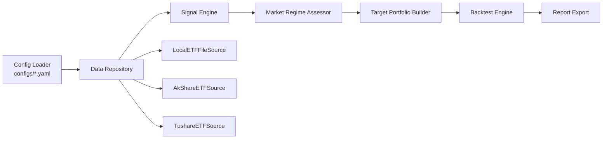

# QuantETF

A-share ETF 轮动交易系统（Python）。

该项目提供从数据获取、信号生成、目标仓位构建、周频调仓回测到报告导出的完整流水线，支持本地文件、AkShare、Tushare 三种数据来源。

## 1. 项目定位

QuantETF 面向以下场景：

- 基于 ETF 历史行情做周频动量轮动策略研究。
- 生成“最新一期”手工调仓信号与交易计划。
- 将远端数据源（AkShare/Tushare）拉取并增量缓存到本地 CSV。

策略层核心是：

- 多因子动量打分（`bias_factor` / `slope_factor` / `efficiency_factor`）
- 横截面排名（`buy_top_n` + `hold_buffer_n`）
- 市场状态过滤（`market_regime_on`）
- 调仓摩擦控制（最小权重变动阈值、缓冲持有、逆波动率权重可选）

## 2. 技术架构总览

项目采用 `src/` 包结构，核心是“编排层 + 领域模块分层”：



主流程编排入口在 [`src/quant_etf/main.py`](/Users/Paul/Documents/QuantETF/src/quant_etf/main.py)：

- `run_backtest_with_config`: 端到端回测与导出。
- `run_backtest_pipeline`: 读取配置目录后执行回测。
- `run_signal_pipeline`: 生成最新信号、目标仓位和调仓计划。

## 3. 分层说明

### 3.1 配置层（Config）

- 路径：`src/quant_etf/config/`
关键文件：
- [`loader.py`](/Users/Paul/Documents/QuantETF/src/quant_etf/config/loader.py): 按顺序合并 `base/universe/strategy/backtest/live/logging.yaml`，支持 `QUANT_ETF_` 前缀环境变量覆盖。
- [`schema.py`](/Users/Paul/Documents/QuantETF/src/quant_etf/config/schema.py): Dataclass 配置模型（`AppConfig`）。
- [`validator.py`](/Users/Paul/Documents/QuantETF/src/quant_etf/config/validator.py): 参数约束校验（窗口长度、权重和、交易参数范围等）。

配置文件位于 `configs/`：

- `base.yaml`: 应用与数据基础设置。
- `universe.yaml`: ETF 池、流动性条件、市场状态参数。
- `strategy.yaml`: 信号、调仓频率、仓位构建参数。
- `backtest.yaml`: 回测区间、初始资金、成本参数。
- `live.yaml`: 实盘预留参数（当前默认关闭）。
- `logging.yaml`: 日志输出参数。

### 3.2 数据层（Data）

- 路径：`src/quant_etf/data/`
- 核心门面：[`repository.py`](/Users/Paul/Documents/QuantETF/src/quant_etf/data/repository.py)
- 数据链路：`Source -> Cleaner -> Preprocessor`

Source 实现：

- [`loader.py`](/Users/Paul/Documents/QuantETF/src/quant_etf/data/loader.py): 本地 CSV/Parquet 读取（逐标的 + 合并文件回退）。
- [`source_akshare.py`](/Users/Paul/Documents/QuantETF/src/quant_etf/data/source_akshare.py): AkShare 拉取 + 分块重试 + 本地缓存。
- [`providers/tushare_provider.py`](/Users/Paul/Documents/QuantETF/src/quant_etf/data/providers/tushare_provider.py): Tushare 拉取 + 复权因子 + 本地缓存。

数据清洗与预处理：

- [`cleaner.py`](/Users/Paul/Documents/QuantETF/src/quant_etf/data/cleaner.py): 列名归一化、缺失处理、去重与基础质量过滤。
- [`preprocessor.py`](/Users/Paul/Documents/QuantETF/src/quant_etf/data/preprocessor.py): 复权处理、保留 `raw_*` 原始价、衍生 `return_1d/listed_days/is_tradeable` 等字段。

### 3.3 信号层（Signal）

- 路径：`src/quant_etf/signal/`
- 编排器：[`signal_engine.py`](/Users/Paul/Documents/QuantETF/src/quant_etf/signal/signal_engine.py)

子模块职责：

- [`features.py`](/Users/Paul/Documents/QuantETF/src/quant_etf/signal/features.py): 计算收益窗口、均线、bias/slope/efficiency、波动率与流动性特征。
- [`momentum.py`](/Users/Paul/Documents/QuantETF/src/quant_etf/signal/momentum.py): 因子横截面标准化（z-score）与加权打分。
- [`ranking.py`](/Users/Paul/Documents/QuantETF/src/quant_etf/signal/ranking.py): 资格筛选、分层排序、`buy_signal/hold_signal` 生成。
- [`regime.py`](/Users/Paul/Documents/QuantETF/src/quant_etf/signal/regime.py): 依据锚定 ETF（默认 510300 + 512100）给周信号打 `market_regime_on/risk_off` 标签。

### 3.4 组合与调仓层（Portfolio / Filter）

- 路径：`src/quant_etf/portfolio/` 与 `src/quant_etf/filter/`

关键组件：

- [`filter/exit_rules.py`](/Users/Paul/Documents/QuantETF/src/quant_etf/filter/exit_rules.py): 持仓卖出判定（缺失信号、止损、风控、连续弱势）。
- [`portfolio/target_builder.py`](/Users/Paul/Documents/QuantETF/src/quant_etf/portfolio/target_builder.py): 构建目标组合，支持风险关闭时降仓或清仓。
- [`portfolio/allocator.py`](/Users/Paul/Documents/QuantETF/src/quant_etf/portfolio/allocator.py): 等权/逆波动率分配，叠加单标的上限约束。
- [`portfolio/rebalance.py`](/Users/Paul/Documents/QuantETF/src/quant_etf/portfolio/rebalance.py): 结合当前持仓生成 `buy/sell/increase/reduce/hold` 交易计划。

### 3.5 回测与报告层（Backtest / Report）

- 路径：`src/quant_etf/backtest/` 与 `src/quant_etf/report/`

回测：

- [`backtest/engine.py`](/Users/Paul/Documents/QuantETF/src/quant_etf/backtest/engine.py): 按“信号日 + 执行延迟”映射成交日，支持 next_open/next_close，处理手续费、滑点、印花税、最小佣金、整手约束。
- [`backtest/metrics.py`](/Users/Paul/Documents/QuantETF/src/quant_etf/backtest/metrics.py): 收益、回撤、夏普、卡玛、胜率、换手、平均持有天数等指标。

报告：

- [`report/export.py`](/Users/Paul/Documents/QuantETF/src/quant_etf/report/export.py): 导出 CSV/JSON/TXT/HTML 全套产物。
- [`report/analyzer.py`](/Users/Paul/Documents/QuantETF/src/quant_etf/report/analyzer.py): 指标再分析 + 定性结论。
- [`report/html_report.py`](/Users/Paul/Documents/QuantETF/src/quant_etf/report/html_report.py): 自包含 HTML 报告。

## 4. 目录结构（精简）

```text
QuantETF/
├── configs/                 # 分模块 YAML 配置
├── data/
│   ├── raw/                 # 本地历史行情缓存
│   └── reports*/            # 回测输出目录（可有多套）
├── main/                    # CLI 脚本入口
│   ├── run_backtest.py
│   ├── run_signals.py
│   └── cache_data.py
├── src/quant_etf/
│   ├── config/
│   ├── data/
│   ├── signal/
│   ├── filter/
│   ├── portfolio/
│   ├── backtest/
│   ├── report/
│   └── main.py              # 业务流水线编排
└── tests/                   # 单元与流水线测试
```

## 5. 运行入口

### 5.1 端到端回测

```bash
python main/run_backtest.py --config-dir configs
```

常用覆盖参数：

- `--provider akshare|local|tushare`
- `--data-dir /path/to/data/raw`
- `--file-format csv|parquet|auto`
- `--output-dir /path/to/output`

### 5.2 生成最新调仓信号

```bash
python main/run_signals.py --config-dir configs
```

可选：

- `--holdings-csv current_holdings.csv`（传入当前持仓）
- `--data-dir /path/to/local/csv`（强制本地数据）

### 5.3 拉取并缓存远端数据

```bash
python main/cache_data.py --config-dir configs --provider tushare --combined
```

常用参数：

- `--start-date 2023-01-01 --end-date 2025-12-31`
- `--output-dir data/raw`
- `--force-reload`

### 5.4 独立策略：年化斜率 × R² ETF 轮动回测

该入口为独立新增策略，不会影响原有主策略流水线。

```bash
python main/run_momentum_rotation_backtest.py \
    --config-dir configs \
    --data-dir data/raw \
    --lookback-days 90 \
    --top-n 4 \
    --output-dir data/reports_momentum_rotation
```

默认资产池覆盖常见宽基/海外/黄金/行业 ETF（纳指、黄金、创业板、消费、科技、医药、新能源等），
可用 `--symbols 513100.SH,518880.SH,159915.SZ,...` 自定义。

## 6. 输入输出约定

### 6.1 本地数据输入（local provider）

默认按 `data.file_pattern` 读取，例如：

- `data/raw/510300.SH.csv`
- `data/raw/159915.SZ.csv`

核心字段要求（可通过别名自动映射）：

- `trade_date`
- `symbol`
- `open`
- `high`
- `low`
- `close`
- `volume`
- `amount`（可缺省，系统可推导）

### 6.2 回测输出

默认输出到 `data/reports`，包含：

- `daily_nav.csv`
- `daily_holdings.csv`
- `trades.csv`
- `weekly_signals.csv`
- `target_portfolio.csv`
- `metrics.json`
- `analysis.json`
- `summary.txt`
- `report.html`

## 7. 安装与测试

### 7.1 安装依赖

```bash
pip install -r requirements.txt
```

或（开发模式）：

```bash
pip install -e .[dev]
```

### 7.2 运行测试

```bash
pytest
```

测试覆盖配置校验、数据源、信号、调仓与完整回测导出链路。

## 8. 当前实现边界

- 当前策略频率固定为周频（`signal_weekday=4`，即周五信号）。
- 交易执行以内置简化撮合模型为主（整手、手续费、滑点），不含盘口级成交细节。
- `live` 相关配置目前是预留接口，主路径仍是研究与离线回测。
